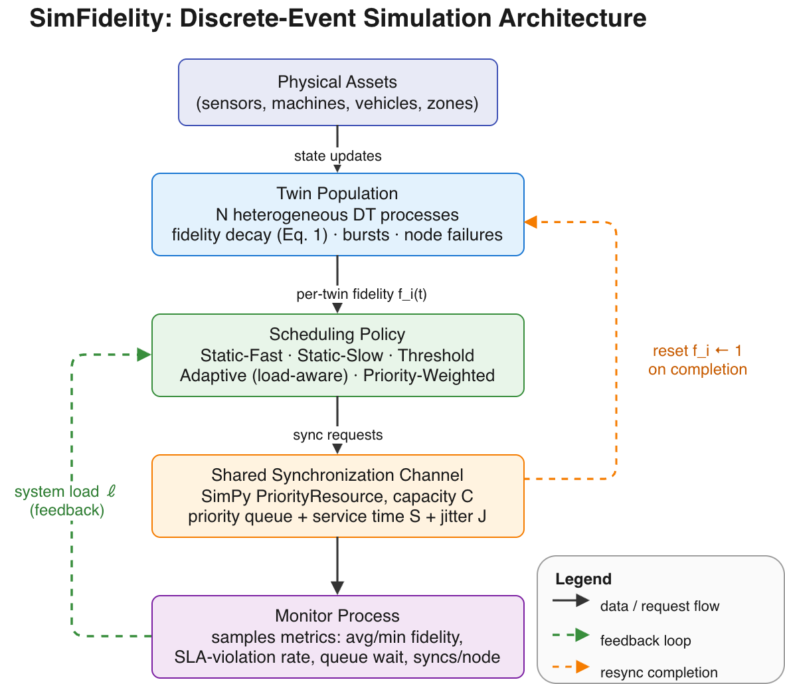
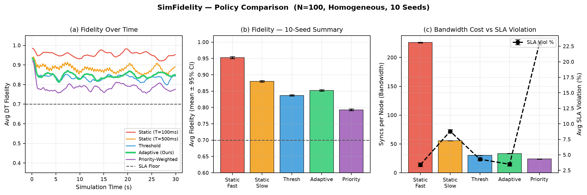
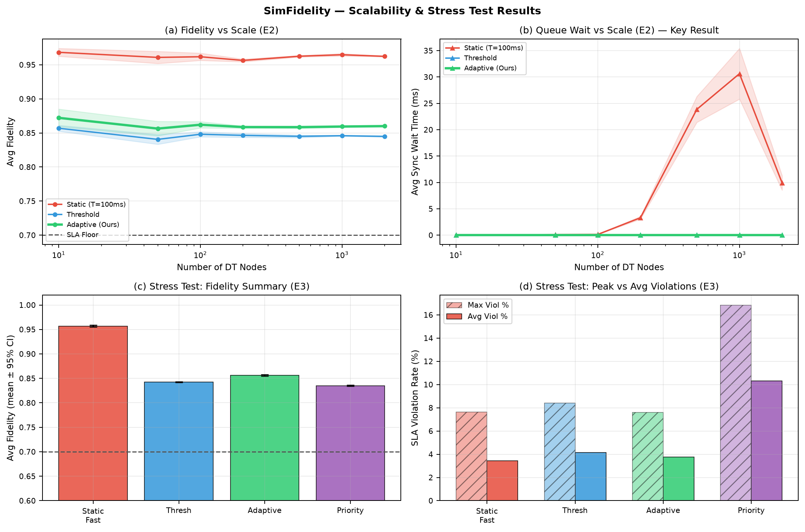
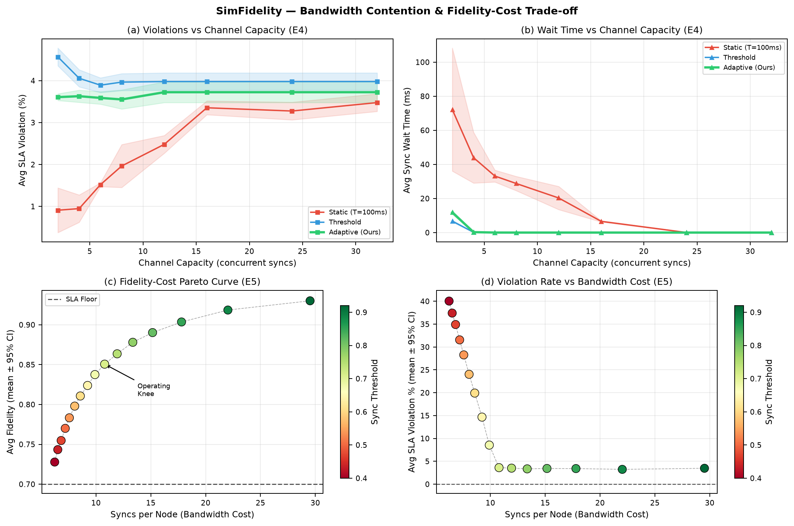

# SimFidelity

**A Distributed Simulation Framework for Fidelity-Aware Synchronization Scheduling in Large-Scale Digital Twin Systems**

> Submitted to: **2026 30th International Symposium on Distributed Simulation and Real-Time Applications (DS-RT 2026)**
> Special Session on Next-Generation Networking and Computing Continuum for Large-Scale Digital Twins
> Padua, Italy — September 16–18, 2026

---

## What is SimFidelity?

SimFidelity is an open discrete-event simulation framework that models a population of heterogeneous digital twin (DT) nodes contending for a shared, bandwidth-limited synchronization channel. It is built on the [SimPy](https://simpy.readthedocs.io/) process-based simulation engine.

The core question it addresses: **when a population of digital twins must share a single synchronization channel, how should you decide which twins to synchronize and when — so that fidelity stays above a service-level floor while minimizing bandwidth cost?**

---

## Files

| File | Description |
|------|-------------|
| `simfidelity_v2.py` | Core simulator — run this to reproduce all experiments |
| `regenerate_figures.py` | Reproduces all three paper figures as PNG |

---

## System Architecture

The diagram below shows how SimFidelity's components connect:



- **Physical Assets** push state updates into the twin population
- **Twin Processes** model per-node fidelity decay, burst events, and node failures
- **Scheduling Policy** decides which twins request synchronization each epoch
- **Shared Channel** (SimPy `PriorityResource`, capacity C) queues and serves requests with jitter
- **Monitor Process** samples population-level metrics and feeds system load back to the adaptive policy (green loop)
- On completion, a sync resets the twin's fidelity to 1 (orange loop)

---

## Results

### Figure A — Policy Comparison (N=100, 10 Seeds)


The load-aware adaptive policy matches Static-Fast's SLA compliance at roughly **7× lower bandwidth cost**. Naive priority weighting starves low-priority twins and performs worst overall.

---

### Figure B — Scalability & Stress Test


Static-Fast's queue wait time explodes beyond N=1,000 nodes. The adaptive and threshold policies remain near-zero latency across three orders of magnitude. Under bursty decay and node failures, adaptive attains the lowest peak violation rate.

---

### Figure C — Bandwidth Contention & Pareto Frontier


The fidelity-cost curve is strongly concave — the first ~10 syncs/node recover most achievable fidelity. Beyond that knee, additional bandwidth yields diminishing returns. The adaptive policy is most valuable when the channel is provisioned near this knee.

---

## Scheduling Policies Compared

| Policy | Description |
|--------|-------------|
| Static-Fast (T=100ms) | Fixed interval, aggressive baseline |
| Static-Slow (T=500ms) | Fixed interval, conservative baseline |
| Threshold | Sync when fidelity drops below SLA floor |
| **Adaptive (Ours)** | Load-aware threshold — defers non-critical twins under high load, pre-empts under low load |
| Priority-Weighted | Threshold shifted by twin priority — causes starvation |

---

## How to Run

```bash
# Install dependencies
pip install simpy numpy scipy matplotlib

# Run the simulator
python3 simfidelity_v2.py

# Reproduce all paper figures (saves fig_A.png, fig_B.png, fig_C.png)
python3 regenerate_figures.py
```

All experiments were run on an Apple M4 workstation. No cluster required.

---

## Key Findings

- No single policy dominates — the choice is a **fidelity vs. bandwidth trade-off**
- The **adaptive policy** achieves SLA compliance comparable to Static-Fast at ~7× lower synchronization cost
- **Naive priority weighting** starves low-priority twins and worsens aggregate violations — a cautionary finding
- The **Pareto frontier** gives system designers a concrete operating-point recipe: find the knee, provision there

---

## Authors

- **Yogesh Rethinapandian** — University of Illinois Chicago (yrethi2@uic.edu)
- **Arun Karthik Sundararajan** — IEEE Member, USA (arunkarthik@ieee.org)
- **Kaushik Kumar** — University of Arizona (kaushikkumar@arizona.edu)
- **Smrithi Prakash** — SRM Institute of Science and Technology (sp9114@srmist.edu.in)

---

## License

MIT License — see `LICENSE` file.
